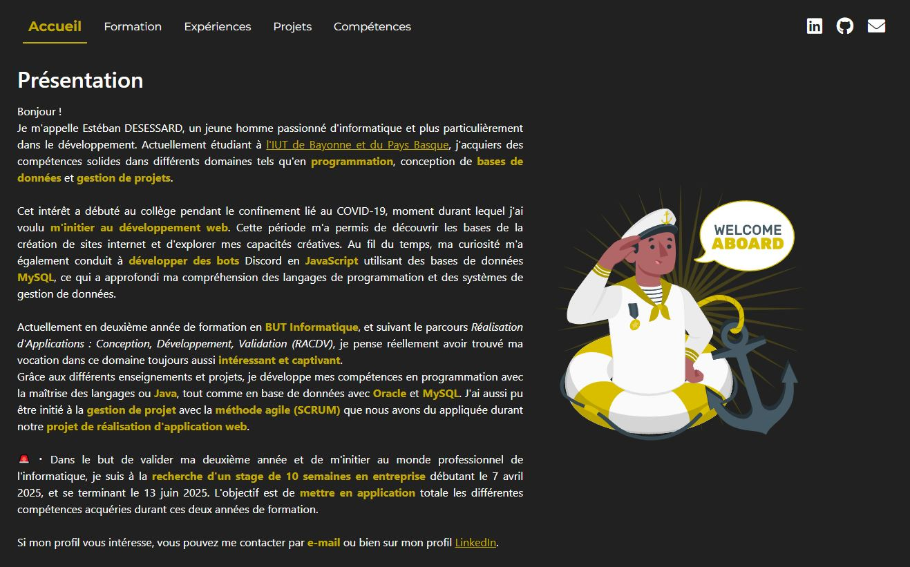

# Portfolio - Estéban DESESSARD

Bienvenue sur le **Portfolio** d'Estéban DESESSARD, étudiant en deuxième année de BUT Informatique à l'IUT de Bayonne et du Pays Basque. Ce projet présente une vitrine de mes compétences, de mes projets réalisés, ainsi que de mon évolution en tant que développeur.

## 🎯 Objectif

Ce portfolio a pour objectif de regrouper tous mes projets ainsi que les compétences acquises au fil de mon parcours. Il se veut être une plateforme simple, intuitive qui sera dans le futur responsive, permettant de visualiser mon profil plus en détails.

## 📂 Sections

### 1. **Accueil**
L'accueil offre une introduction rapide à mon profil, mon parcours académique, et mes projets récents.

### 2. **Formation**
Cette section retrace mon parcours scolaire, détaillant les diplômes et compétences acquises tout au long de ma formation.

### 3. **Expériences**
Vous trouverez ici mes expériences professionnelles et académiques, notamment mes stages et projets menés en équipe.

### 4. **Projets**
Chaque projet est documenté avec une brève description, les technologies utilisées, et des captures d'écran du code ou de l'application.

### 5. **Compétences**
Une vue d'ensemble des technologies, langages de programmation et outils que je maîtrise, y compris **HTML, CSS, JavaScript, Bootstrap, Git**, et bien d'autres.

### 6. **Contact**
Dans le cas où vous désirez mieux me connaître où obtenir quelconque information supplémentaire, un formulaire simple vous permet de rentrer en contact avec moi.

## 🛠️ Technologies Utilisées

- **HTML5** : Structuration du contenu
- **CSS3** : Design personnalisé avec un focus sur l'accessibilité et le responsive
- **Bootstrap** : Librarie CSS utilisée pour accélérer le développement
- **JavaScript** : Ajout d'interactivité sur certaines sections
- **Git** : Versionnement
- **Twig** : Moteur de template pour factoriser du code HTML

## 🚀 Fonctionnalités

- **Navigation fluide** : Grâce à la barre de navigation intuitive et l'organisation claire des contenus.
- **Design épuré** : Une approche minimaliste pour mettre en avant le contenu et la simplicité de la navigation.

## 📸 Aperçu

## 📅 Statut du projet

Le projet est actuellement **en cours de développement**, avec des mises à jour régulières afin de maintenir un portfolio actualisé et complet.

## 💡 Inspirations

Ce projet est né de la nécessité de créer une plateforme pour présenter mes compétences et projets dans le cadre de la recherche de stage. Il a été entièrement codé à la main en **HTML**, **CSS** et **JavaScript** afin de continuer à m'améliorer en développement front-end et back-end.

## 👤 Auteur

- **Estéban DESESSARD** - [LinkedIn](https://www.linkedin.com/in/e-desessard) | [GitHub](https://github.com/CarteSD)

## 🔗 Lien

Le portfolio est disponible à l'adresse suivante : **[Mon Portfolio](#)**
